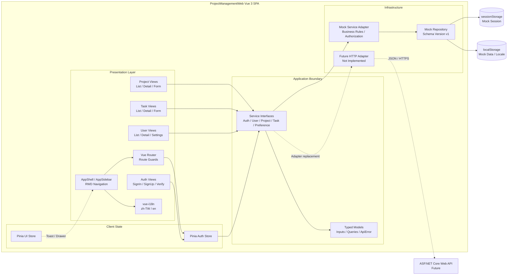
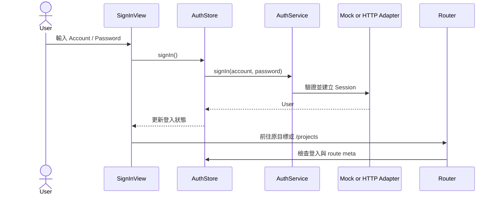
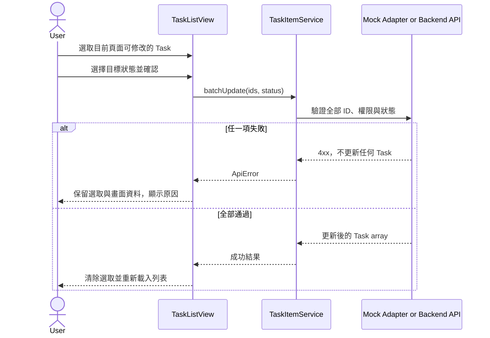

# ProjectManagementWeb 前端架構

## 架構狀態

目前是 Vue 3 SPA 的 V1 前端 MVP。畫面已透過 typed service interfaces 與資料來源隔離，但實際資料來源仍是 `MockServices` 與瀏覽器 Storage；Backend HTTP adapter 尚未建立。

## Level 3 Component Diagram



## 元件責任

| 元件                 | 主要責任                                         | 不應負責                            |
| -------------------- | ------------------------------------------------ | ----------------------------------- |
| Views                | 組合畫面、讀取 route、觸發 service、顯示狀態     | 直接讀寫 localStorage、實作後端授權 |
| AppShell／AppSidebar | RWD 版型、專案樹、語言切換、Logout               | Project／Task 業務規則              |
| Vue Router           | 公開／登入路由、基本角色導向、lazy loading       | 作為安全授權邊界                    |
| Pinia Auth Store     | 目前使用者、Session restore、登入登出狀態        | 複製所有後端業務資料                |
| Pinia UI Store       | Sidebar 與 Toast 等全域 UI 狀態                  | 持久化 domain data                  |
| Service Interfaces   | 定義 View 可依賴的穩定操作介面                   | 洩漏 Mock 或 HTTP 實作細節          |
| Mock Service Adapter | 模擬授權、驗證、交易、軟刪除與版本衝突           | 被視為正式安全邊界                  |
| Mock Repository      | schema version、seed、Storage 序列化             | 在 View 中直接暴露 Storage API      |
| Future HTTP Adapter  | 將 service calls mapping 成 Backend HTTP request | 改變 Views 的呼叫方式               |

## 依賴方向

```text
View / Store
    ↓
Service Interface + Models
    ↓
Mock Adapter（目前）或 HTTP Adapter（未來）
    ↓
Browser Storage（目前）或 Backend API（未來）
```

View 與 Store 只能依賴 service interface。串接後端時，應新增 HTTP adapter 並在應用程式組裝點替換實作，不應讓 Vue component 直接散落 `fetch` 呼叫。

## 主要資料流程

### 登入與 Route Guard



### Task 批次更新



## Route 與 View 分組

| Feature    | Views                                           | 主要 Route                              |
| ---------- | ----------------------------------------------- | --------------------------------------- |
| Auth       | SignIn、SignUp、VerifyEmail、ResendVerification | `/sign-in`、`/sign-up`、`/verify-email` |
| Project    | ProjectList、ProjectDetail、ProjectForm         | `/projects`、`/projects/:projectId`     |
| Task       | TaskList、TaskDetail、TaskForm                  | `/projects/:projectId/task-items`       |
| User       | UserList、UserDetail                            | `/users`、`/users/:userId`              |
| Preference | Settings                                        | `/settings`                             |
| Error      | Forbidden、NotFound                             | `/forbidden`、fallback route            |

## Storage Boundary

| Storage        | Key                                 | 用途                                               |
| -------------- | ----------------------------------- | -------------------------------------------------- |
| localStorage   | `project-management-web:mock-db:v1` | Mock users、projects、tasks、comments、preferences |
| localStorage   | `project-management-web:locale`     | `zh-TW`／`en` 選擇                                 |
| sessionStorage | `project-management-web:session:v1` | Mock 登入使用者 ID                                 |

Storage 僅是 V1 Demo infrastructure。正式串接時不得把真實密碼、Access Token 或機密資料沿用此方式保存。

## 串接後端的架構變更

1. 保留 `contracts.ts` 與 View 呼叫方式。
2. 依 `ApiList.md` 與正式 OpenAPI 實作 HTTP adapters。
3. 新增 request／response DTO 與 mapper，不直接把 Backend DTO 當 ViewModel。
4. 在應用程式組裝點注入 HTTP services，移除 production bundle 對 Mock repository 的依賴。
5. 依後端驗證設計補上 Cookie／Token refresh、CSRF、401 retry 與 timeout。
6. Contract tests 通過後，才移除 Demo-only `reset()` 與預設密碼提示。
