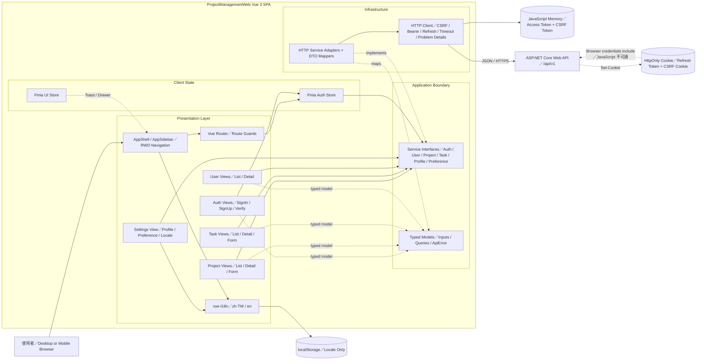
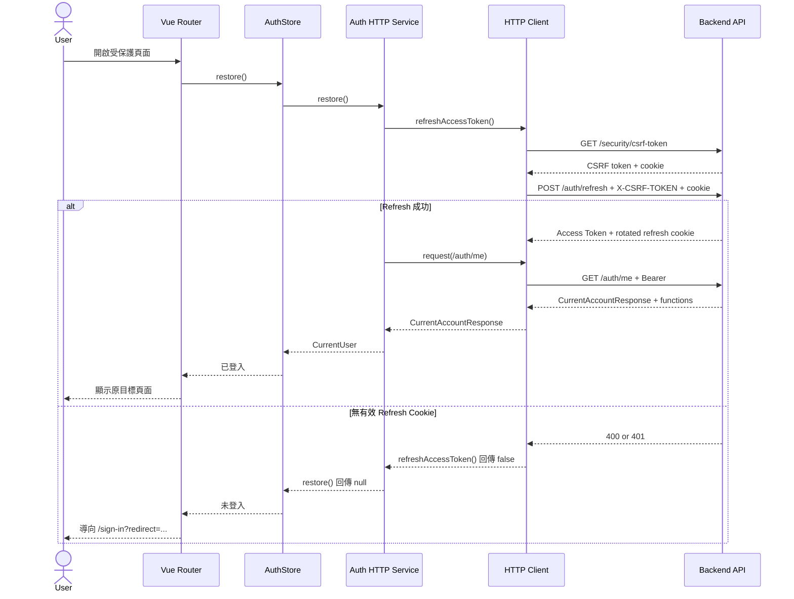
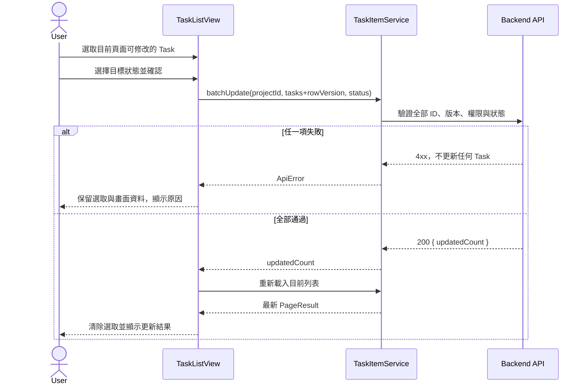

# ProjectManagementWeb 前端架構

## 架構狀態

目前 Vue 3 SPA 已透過 typed service interfaces、HTTP adapters 與 DTO mappers 串接 ASP.NET Core `/api/v1`。View 不直接散落 `fetch`；登入狀態由 Pinia Auth Store 協調，CSRF、Bearer、refresh、timeout 與錯誤正規化則集中於 HTTP client。

## Level 3 Component Diagram



## 元件責任

| 元件                  | 主要責任                                                       | 不應負責                     |
| --------------------- | -------------------------------------------------------------- | ---------------------------- |
| Views                 | 組合畫面、讀取 route、觸發 service、顯示 loading／error／empty | 直接呼叫 fetch、取代後端授權 |
| AppShell／AppSidebar  | RWD 版型、專案樹、語言切換、Logout                             | Project／Task 業務規則       |
| Vue Router            | 公開／登入路由、requiredFunction 導向、lazy loading            | 作為安全授權邊界             |
| Pinia Auth Store      | 目前使用者、Session restore、登入登出與 Functions              | 複製所有後端業務資料         |
| Pinia UI Store        | Sidebar、Toast 等暫時 UI 狀態                                  | 持久化 domain data           |
| vue-i18n              | `zh-TW`／`en` 翻譯及 locale                                    | 儲存登入憑證                 |
| Service Interfaces    | 定義 Auth、User、Project、Task、Profile、Preference 操作       | 洩漏 transport DTO           |
| HTTP Service Adapters | 將 service call 映射成 request，並把 DTO 映射為 View model     | 直接控制 Vue component       |
| HTTP Client           | Base URL、Bearer、CSRF、refresh、timeout、Problem Details      | 實作 Project／Task 業務規則  |

## 依賴方向

```text
View / Store
    ↓
Service Interface + Models
    ↓
HTTP Adapter + DTO Mapper
    ↓
ASP.NET Core Backend API
```

View 與 Store 依賴 `AppServices` 介面與 typed models；`services/index.ts` 是 production 組裝點，只匯出 HTTP services。傳輸 DTO、URL、CSRF 與 refresh 不會散落至 Vue component。

## 主要資料流程

### 啟動與恢復 Session



### Task 批次更新



## Route 與 View 分組

| Feature    | Views                                           | 主要 Route                                                                                                                                                                      |
| ---------- | ----------------------------------------------- | ------------------------------------------------------------------------------------------------------------------------------------------------------------------------------- |
| Auth       | SignIn、SignUp、VerifyEmail、ResendVerification | `/sign-in`、`/sign-up`、`/verify-email`、`/resend-verification`                                                                                                                 |
| Project    | ProjectList、ProjectDetail、ProjectForm         | `/projects`、`/projects/:projectId`、`/admin/projects/new`、`/admin/projects/:projectId/edit`                                                                                   |
| Task       | TaskList、TaskDetail、TaskForm                  | `/projects/:projectId/task-items`、`/projects/:projectId/task-items/:taskId`、`/admin/projects/:projectId/task-items/new`、`/admin/projects/:projectId/task-items/:taskId/edit` |
| User       | UserList、UserDetail                            | `/users`、`/users/:userId`                                                                                                                                                      |
| Preference | Settings                                        | `/settings`                                                                                                                                                                     |
| Error      | Forbidden、NotFound                             | `/forbidden`、fallback route                                                                                                                                                    |

## Browser State Boundary

| 位置              | 用途                                                                   |
| ----------------- | ---------------------------------------------------------------------- |
| JavaScript memory | 短效 Access Token、CSRF request token 與 single-flight refresh Promise |
| HttpOnly Cookie   | Backend 管理的 Refresh Token；前端 JavaScript 無法讀取                 |
| CSRF Cookie       | Backend antiforgery 機制使用；由 Browser 隨 credentials 傳送           |
| localStorage      | 僅保存 `project-management-web:locale` 介面語言                        |
| URL query         | Task 搜尋、篩選、排序、頁碼及返回列表時的可分享狀態                    |
| Component state   | 表單輸入、loading、error 與當頁 Task checkbox selection                |

Production bundle 不包含 Mock database、Demo 帳密、資料重設功能或 sessionStorage 登入狀態。HTTP client 以 `credentials: include` 讓 Browser 傳送 Cookie，但所有業務 API 仍以 Bearer Access Token 驗證。

## HTTP 邊界

1. `contracts.ts` 維持 View 可依賴的 Auth、User、Project、Task、Profile 與 Preference 介面。
2. `httpServices.ts` 實作 38 組 Method／Route，並將 API DTO 映射為前端 model。
3. `httpClient.ts` 統一處理 `/api/v1`、CSRF、Bearer、single-flight refresh、一次重送、15 秒 timeout、取消與 Problem Details。
4. Project、Task 與 Comment update／delete 明確傳遞 Base64 `rowVersion`。
5. Profile、Preference 與角色狀態更新均透過專用 endpoint，不直接操作 Browser Storage 或資料庫欄位。
6. route guard 與按鈕只提供 UX 限制，Backend 仍逐次驗證 Function、系統角色、membership、assignee 與 author scope。

## 部署與信任邊界

- Vite build 產生靜態 SPA；正式環境需由 Web Server 提供 history fallback，讓 Vue Router 路由重新整理時仍回傳 `index.html`。
- `VITE_API_BASE_URL` 會被編譯進前端 bundle，只能放公開 origin，不能存放 secret。
- Frontend 與 Backend 若跨 origin，Backend 必須允許明確的 SPA origin、credentials 與 `X-CSRF-TOKEN` header；不得使用萬用 CORS origin 搭配 credentials。
- Browser UI、route guard 與前端 Functions 都是不可信任輸入的一部分；資料授權、並行控制與交易一致性一律由 Backend 負責。
