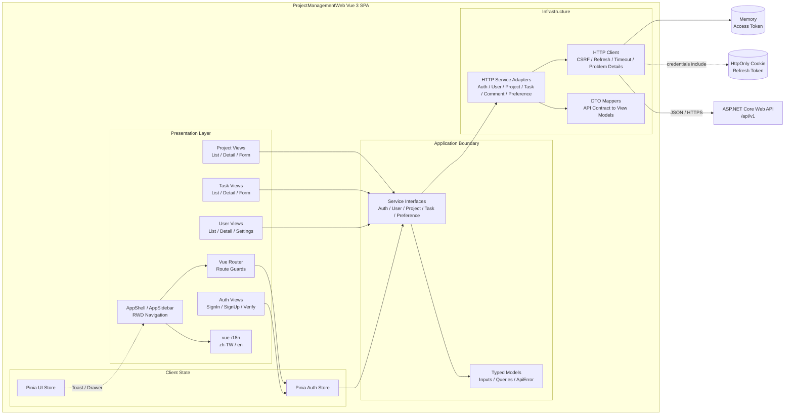
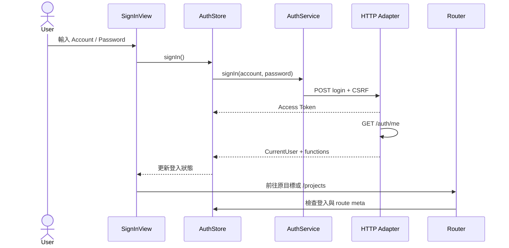
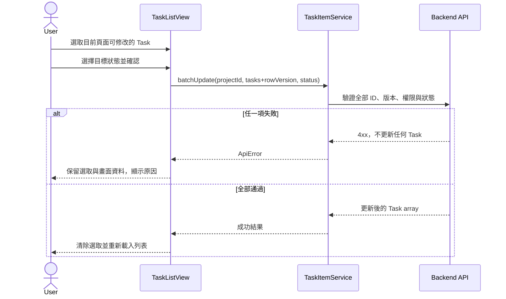

# ProjectManagementWeb 前端架構

## 架構狀態

目前 Vue 3 SPA 已透過 typed service interfaces、HTTP adapters 與 DTO mappers 串接 ASP.NET Core `/api/v1`。View 不直接散落 `fetch`，驗證與錯誤處理由共用 HTTP client 負責。

## Level 3 Component Diagram



## 元件責任

| 元件                  | 主要責任                                             | 不應負責                            |
| --------------------- | ---------------------------------------------------- | ----------------------------------- |
| Views                 | 組合畫面、讀取 route、觸發 service、顯示狀態         | 直接讀寫 localStorage、實作後端授權 |
| AppShell／AppSidebar  | RWD 版型、專案樹、語言切換、Logout                   | Project／Task 業務規則              |
| Vue Router            | 公開／登入路由、基本角色導向、lazy loading           | 作為安全授權邊界                    |
| Pinia Auth Store      | 目前使用者、Session restore、登入登出狀態            | 複製所有後端業務資料                |
| Pinia UI Store        | Sidebar 與 Toast 等全域 UI 狀態                      | 持久化 domain data                  |
| Service Interfaces    | 定義 View 可依賴的穩定操作介面                       | 洩漏 Mock 或 HTTP 實作細節          |
| HTTP Service Adapters | 將 service calls mapping 成 Backend HTTP request     | 在 View 中改變 transport 細節       |
| DTO Mappers           | 隔離 API DTO 與畫面 model                            | 實作授權或保存 token                |
| HTTP Client           | Base URL、Bearer、CSRF、refresh、timeout、錯誤正規化 | 實作 Project／Task 業務規則         |

## 依賴方向

```text
View / Store
    ↓
Service Interface + Models
    ↓
HTTP Adapter + DTO Mapper
    ↓
ASP.NET Core Backend API
```

View 與 Store 只依賴 service interface；production 組裝點只匯出 HTTP services，不讓 Vue component 直接散落 `fetch` 呼叫。

## 主要資料流程

### 登入與 Route Guard



### Task 批次更新



## Route 與 View 分組

| Feature    | Views                                           | 主要 Route                              |
| ---------- | ----------------------------------------------- | --------------------------------------- |
| Auth       | SignIn、SignUp、VerifyEmail、ResendVerification | `/sign-in`、`/sign-up`、`/verify-email` |
| Project    | ProjectList、ProjectDetail、ProjectForm         | `/projects`、`/projects/:projectId`     |
| Task       | TaskList、TaskDetail、TaskForm                  | `/projects/:projectId/task-items`       |
| User       | UserList、UserDetail                            | `/users`、`/users/:userId`              |
| Preference | Settings                                        | `/settings`                             |
| Error      | Forbidden、NotFound                             | `/forbidden`、fallback route            |

## Browser State Boundary

| 位置              | 用途                                           |
| ----------------- | ---------------------------------------------- |
| JavaScript memory | 短效 Access Token；重新整理後先以 refresh 恢復 |
| HttpOnly Cookie   | Backend 管理的 Refresh Token，前端無法讀取     |
| localStorage      | 僅保存 `zh-TW`／`en` 介面語言                  |

Production bundle 不包含 Mock database、Demo 帳密、資料重設功能或 sessionStorage 登入狀態。HTTP client 以 `credentials: include` 傳送 Cookie，但所有業務 API 仍以 Bearer Access Token 驗證。

## HTTP 邊界

1. `contracts.ts` 維持 View 可依賴的穩定介面。
2. `httpServices.ts` 將 API DTO 映射為前端 model，不讓 View 依賴 transport shape。
3. `httpClient.ts` 統一處理 `/api/v1`、CSRF、Bearer、single-flight refresh、一次重送、timeout、取消與 Problem Details。
4. Task／Comment request 明確傳遞 projectId、taskId 與 Base64 rowVersion。
5. route guard 與按鈕只提供 UX 限制，Backend 仍逐次驗證 function 與資源範圍。
